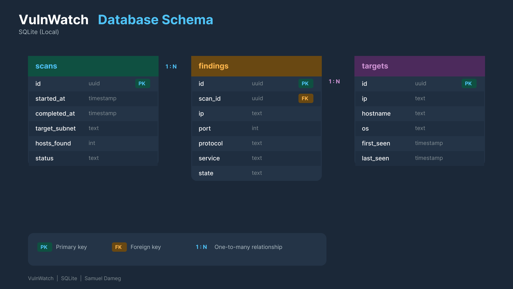

# VulnWatch

A local network vulnerability scanner with a cybersecurity-themed web dashboard. Scans your home network for devices, open ports, and running services. Results are stored locally and displayed in a dark-themed React dashboard.

> Only scan networks you own. Requires nmap and Administrator privileges for OS detection.

## Features

- Scan your network for devices, open ports, and OS fingerprints
- Store scan history locally in SQLite for comparison over time
- Dark-themed dashboard with stat cards, bar chart, and tabbed views
- Suspicious service flagging (RTSP, telnet, etc. on unknown devices)
- Trigger scans from the dashboard, no terminal needed after setup

## Tech Stack

| Layer | Technology |
|-------|-----------|
| Scanner | Python 3, python-nmap |
| API | FastAPI, uvicorn |
| Database | SQLite via SQLAlchemy |
| Dashboard | React, Vite, TypeScript, Tailwind CSS |
| Charts | Recharts |

## Database Schema



## Setup

### Requirements

- Python 3.10+
- Node.js 18+
- [nmap](https://nmap.org/download.html) installed on your system

### Backend

```bash
cd backend
py -m pip install -r requirements.txt
py -m uvicorn main:app --reload --port 8000
```

> Run the terminal as Administrator for OS detection (-O flag).

### Frontend

```bash
cd frontend
npm install
npm run dev
```

Open `http://localhost:5173` in your browser.

### Running a Scan

**From the dashboard:** Click `[ run scan ]` and the backend spawns the scanner automatically.

**From the terminal:**

```bash
cd backend
py scanner.py
# or with a custom subnet:
py scanner.py --target 10.0.0.0/24
```

## Project Structure

```
vulnwatch/
├── backend/
│   ├── main.py        # FastAPI app, all routes
│   ├── scanner.py     # nmap wrapper, parses results
│   ├── database.py    # SQLAlchemy models + SQLite
│   ├── schemas.py     # Pydantic request/response models
│   └── requirements.txt
├── frontend/
│   └── src/
│       ├── App.tsx
│       ├── api.ts
│       ├── types.ts
│       └── components/
│           ├── StatCards.tsx
│           ├── FindingsTable.tsx
│           ├── DevicesTable.tsx
│           ├── ScanHistory.tsx
│           ├── PortChart.tsx
│           └── StateBadge.tsx
└── docs/
    └── schema.png
```

## API Endpoints

| Method | Path | Description |
|--------|------|-------------|
| POST | /api/scans | Save scanner results |
| POST | /api/scans/trigger | Trigger scanner from dashboard |
| GET | /api/scans | List all scans |
| GET | /api/scans/{id} | Scan detail with findings |
| GET | /api/targets | All discovered devices |
| GET | /api/targets/{ip} | Device history |
| GET | /api/stats | Dashboard summary stats |
